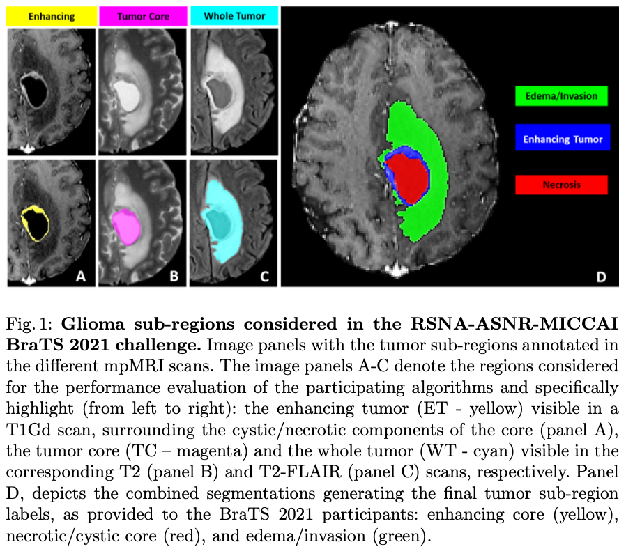

# The RSNA-ASNR-MICCAI BraTS 2021 Benchmark on Brain Tumor Segmentation and Radiogenomic Classification
## References
* https://arxiv.org/pdf/2107.02314.pdf
* https://www.kaggle.com/competitions/rsna-miccai-brain-tumor-radiogenomic-classification/overview

## Summary
- Methylated MGMT+ vs. unmethylated MGMT- tumors					
- O[6]-methylguanine-DNA methyltransferase (MGMT) is a DNA repair en- zyme that the methylation of its promoter in newly diagnosed GBM has been identified as a favorable prognostic factor and a predictor of chemotherapy response 
### MRI Scan types
1. Fluid Attenuated Inversion Recovery (FLAIR)
2. T1-weighted pre-contrast (T1w)
3. T1-weighted post-contrast (T1Gd)
4. T2-weighted (T2)
### Preprocessing
1. Pre-processing routine applied to all BraTS mpMRI scans. Publicly available in Cancer Imaging Phenomics Toolkit https://cbica.github.io/CaPTk/ 
2. Conversion of DICOM files to NIfTI files (strips the metadtaa from DICOM images and removes all Protected Health Information PHI from DICOM headers)
3. Co-registration the same anatomical template (SRI24)
4. Resampling to a uniform isotropic resolution (1mm^3)
5. Skull-stripping (makes it difficult for facial recognition/reconstruction of patient. 6. Use DL approach that accounts for the brain shape prior and is agnostic to the MRI sequence input)
## Task 1 (Tumor sub-region segmentation)
- All imaging volumes segmented using STAPLE fusion previous top rated BraTS algorithms nnU-Net, DeepScan, DeepMedic
- Segmentations were manually refined by radiologists
### Tumor segmentation labels
1. Gd-enhanced tumor (ET - label 4). 
    - “Enhanced tumor”
    Visually avid as well as faint enhancement on T1Gd MRI.
2. Peritumoral edematous/invaded tissue (ED - label 2).
    - Hyperintensive signal envelope on T2 FLAIR volumes that includes infiltrated non enhanced tumor as well as vasogenic edema in the peritumoral region.
3. Necrotic tumor core (NCR - label 1).
    - Hypointensive on T1Gd MRI
4. “Tumor core”. TC. 
    - Includes ET and NCR
    - Typically this is what is surgically removed
5. “Whole tumor” WT
    - Includes TC and ED

- The challenge evaluated segmentations of “enhancing tumor” ET, “tumor core” TC and “whole tumor” WT
    ```
    Labels:
    1 = NCR
    2 = ED
    4 = ET
    0 = everything else

    ET = 4
    TC = 4 + 1
    WT = 4 + 1 + 2
    ```
### Evaluation
- Dice similarity coefficient
- Hausdorff distance 95%
- Sensitivity and specificity – determine potential over or under segmentation of tumor sub-regions
<!--  -->


## Task 2 (Radiogenomic Classification)
### Pre-processing
1. Same preprocessing as Task 1 to get skull-stripped volumes. 
2. Converted from NIfTI to DICOM file format. (needs both the skull-stirpped brain volume in NIfTI format and original DICOM scan. DICOM read as ITK image and skull-stripped volume is registered to it. The segmentation labels are transferred over using same transformation matrix. Separate transform for each modality. Transformed volumes go through CaPTk’s NIfTI to DICOM conversion engine to generate DICOM image volumes for the skull-stripped images
3. Further de-identification 
    - RSNA CTP (clinical trial processor) anonymizer 
    - Whitelisting the DICOM files to remove non-essential tags from the DICOM header
### Evaluation
* AUC (area under ROC curve)
* Accuracy
* FScore (Beta)
*  Matthew’s Correlation Coefficient of the classification of MGMT status as unmethylated/methylated

### MGMT promoter methylation status was determined after biopsy.
* Pyrosequencing
    * The average percentage of methylation on the CpG 74-81 site in the MGMT gene above 10% was interpreted as positive, below 10% is negative. 
* next generation quantitative bisulfite sequence of the promoter CpG sites
    * Interpreted as positive if 2% or more methylated CpG sites in the MGMT promoter (out of 17 total sites)

Traditional radiogenomic algorithms consider volumetric parameters, intensity, morphologic, histogram-based, textural features, spatial information, glioma diffusion properties 
